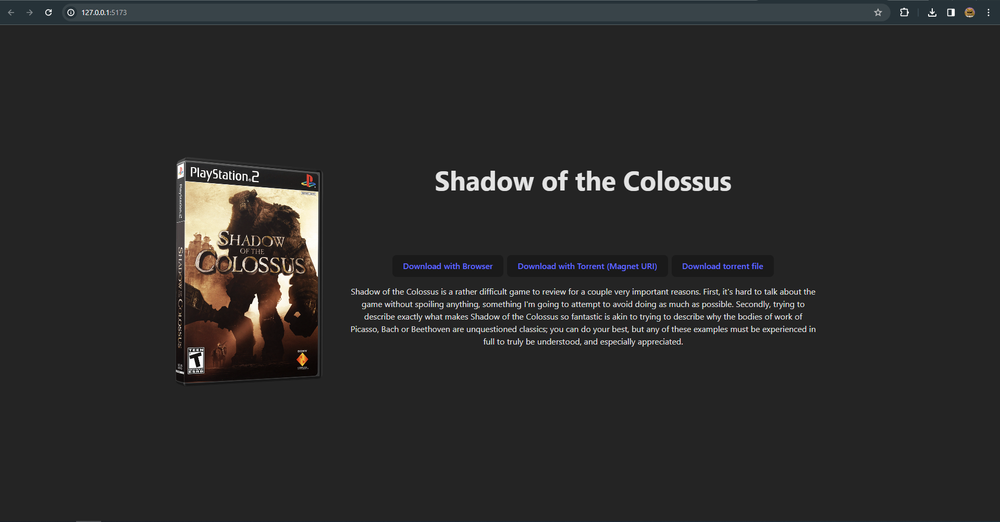

# Retro Archive
This site was created to gain experience with Peer-to-Peer (P2P) systems, specifically the BitTorrent protocol. While only intended for educational purposes, it does improve upon on the current retro gaming and emulation eco-system.  

## Usage
1. Save games as (compressed) .iso files in `/public/roms`
2. For each file, enter its metadata into `/public/roms/index.json`
2. Build and run the docker image, or run `yarn dev` for a dev environment
3. Profit

## Structure
The server runs [OpenTracker](https://erdgeist.org/arts/software/opentracker/) as a closed private tracker, and [Transmission](https://transmissionbt.com/) as a BitTorrent client. The client is configured to be as altruistic as possible, and always seed. This combination ensures atleast 1 peer is seeding any game found on the website at any time, and that all peers are easily discovered by new clients. 

The web site is a simple Preact web app, using the entries from `/public/roms/index.json` to display games. In a production environment this would likely be implemented as a database. The site is served by Nginx, which also acts a reverse proxy for the other services.

Finally, playstation 2 games with the correct serial number specified in `/public/roms/index.json` will automatically use cover images from `https://raw.githubusercontent.com/xlenore/ps2-covers`. Other consoles will not have any cover images unless the source code is modified.